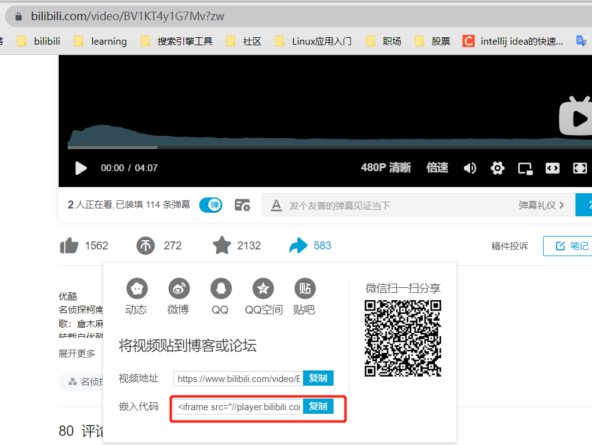

# 插入音视频


## 插入音频

### 1. 直接使用音乐平台生成的插件外链

```
<iframe frameborder="no" border="0" marginwidth="0" marginheight="0" width=330 height=86 src="//music.163.com/outchain/player?type=2&id=478507889&auto=0&height=66"></iframe>
其中478507889为网易云音乐平台该歌曲的id
```

效果：

   <iframe frameborder="no" border="0" marginwidth="0" marginheight="0" width=340 height=86 src="//music.163.com/outchain/player?type=2&id=478507889&auto=0&height=66"></iframe>


### 2. 使用插件 hexo-tag-aplayer

   安装

   ```json
   npm install --save hexo-tag-aplayer
   ```


* 使用MeingJS 支持 (3.0 新功能)的音乐

   [MetingJS](https://github.com/metowolf/MetingJS) 是基于[Meting API](https://github.com/metowolf/Meting) 的 APlayer 衍生播放器，引入 MetingJS 后，播放器将支持对于 QQ音乐、网易云音乐、虾米、酷狗、百度等平台的音乐播放。

   如果想在本插件中使用 MetingJS，请在 Hexo 配置文件 `_config.yml` 中设置：

   ```
   aplayer:
     meting: true
   ```

举例：


```

```

效果：




其中 id 可以从音乐平台生成的外链中查看到

有关 `` 的选项列表如下:

| 选项          | 默认值     | 描述                                                        |
| ------------- | ---------- | ----------------------------------------------------------- |
| id            | **必须值** | 歌曲 id / 播放列表 id / 相册 id / 搜索关键字                |
| server        | **必须值** | 音乐平台: `netease`, `tencent`, `kugou`, `xiami`, `baidu`   |
| type          | **必须值** | `song`, `playlist`, `album`, `search`, `artist`             |
| fixed         | `false`    | 开启固定模式                                                |
| mini          | `false`    | 开启迷你模式                                                |
| loop          | `all`      | 列表循环模式：`all`, `one`,`none`                           |
| order         | `list`     | 列表播放模式： `list`, `random`                             |
| volume        | 0.7        | 播放器音量                                                  |
| lrctype       | 0          | 歌词格式类型                                                |
| listfolded    | `false`    | 指定音乐播放列表是否折叠                                    |
| storagename   | `metingjs` | LocalStorage 中存储播放器设定的键名                         |
| autoplay      | `true`     | 自动播放，移动端浏览器暂时不支持此功能                      |
| mutex         | `true`     | 该选项开启时，如果同页面有其他 aplayer 播放，该播放器会暂停 |
| listmaxheight | `340px`    | 播放列表的最大长度                                          |
| preload       | `auto`     | 音乐文件预载入模式，可选项： `none`, `metadata`, `auto`     |
| theme         | `#ad7a86`  | 播放器风格色彩设置                                          |

### 3. 参考

[hexo-tag-aplayer](https://github.com/MoePlayer/hexo-tag-aplayer/blob/master/docs/README-zh_cn.md)


## 插入视频

### 1.插入外链



```
<iframe height=500 width=600 src="//player.bilibili.com/player.html?aid=925164961&bvid=BV1KT4y1G7Mv&cid=175525923&page=1" scrolling="no" border="0" frameborder="no" framespacing="0" allowfullscreen="true"> </iframe>
```

<iframe height=500 width=600 src="//player.bilibili.com/player.html?aid=925164961&bvid=BV1KT4y1G7Mv&cid=175525923&page=1" scrolling="no" border="0" frameborder="no" framespacing="0" allowfullscreen="true"> </iframe>


### 2.使用 hexo-tag-dplayer 插件

```
{% 
    dplayer         
    "url=/resources/video/ELDEN EING 星星时代.mp4"  //设置视频目录，这里我放在了网站根目录下面，也就是public目录下面     
    "pic=/resources/images/scenery_three.jpeg" //设置封面图，同样是放在根目录下面     
    "loop=yes"  //循环播放    
    "theme=#FADFA3"   //主题    
    "autoplay=true"  //自动播放    
    "screenshot=true" //允许截屏    
    "hotkey=true" //允许hotKey，比如点击空格暂停视频等操作    
    "preload=auto" //预加载：auto    
    "volume=0.9"  //初始音量    
    "playbackSpeed=1"//播放速度1倍速，可以选择1.5,2等   
    "lang=zh-cn"//语言    
    "mutex=true"//播放互斥，就比如其他视频播放就会导致这个视频自动暂停    //下面是弹幕相关    
    "id=9E2E3368B56CD123BB4"    
    "api=https://api.prprpr.me/dplayer/"    
    "token=tokendemo"    
    "maximum=1000"    
    "addition=['https://api.prprpr.me/dplayer/v3/bilibili?aid=4157142']"    
    "user=DIYgod"    
    "bottom=15%"    
    "unlimited=true"
%}
```

举例1：


举例2：
 

### 3. 参考

[hexo-tag-dplayer](https://github.com/MoePlayer/hexo-tag-dplayer)